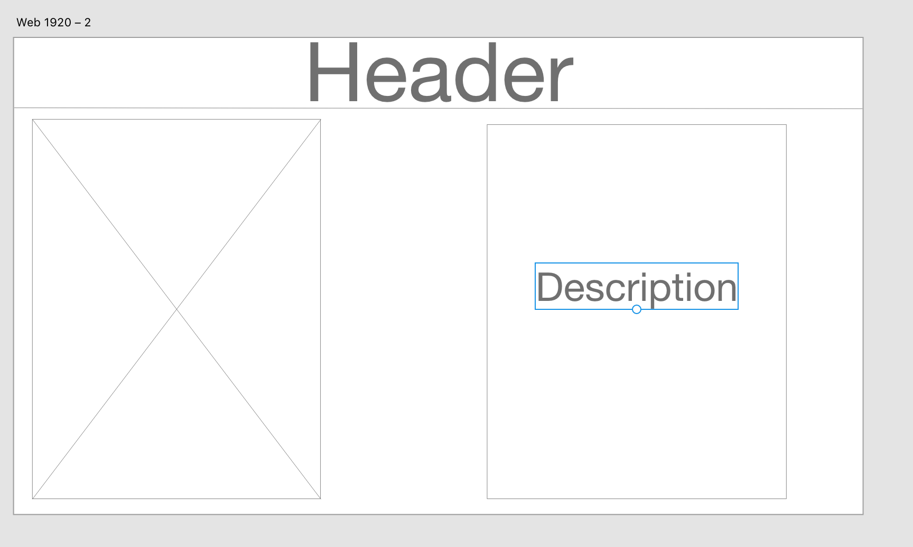

# Studio Ghibil

### Api https://ghibliapi.herokuapp.com/

Studio Ghibli, Inc. is a Japanese animation film studio based in Koganei, Tokyo, Japan. The studio is best known for its anime feature films, and has also produced several short films, television commercials, and one television film.

## Wireframes

## Project Description 

This is a web app to provide information on Studio Ghibli, Inc's films. Information about characters, locations, release dates, RT scores, etc..
Will also show pictures about the information.

## MVP

MVP will be just the basic information and basic display. Being able to look through all the films and find their information. Will have pages for each film.

## Post MVP

Post MVP will be very visual. High Def images and a lot of css.

## Issues

API doesn't have any images. I will have to hardcode all images. 